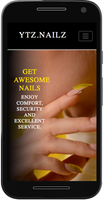
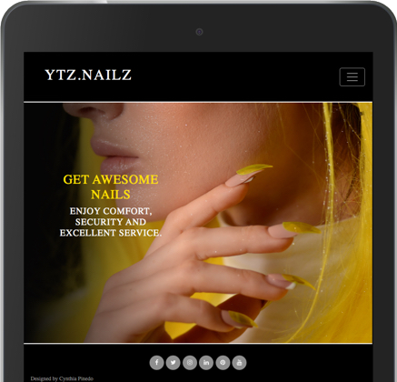
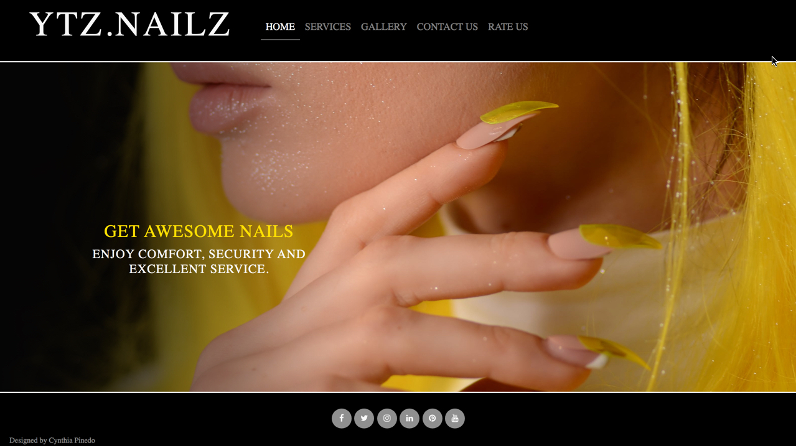
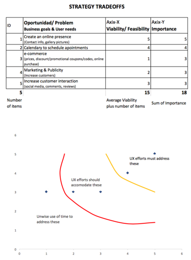
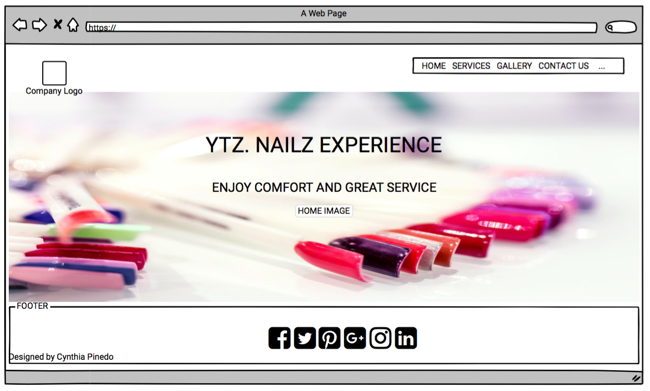
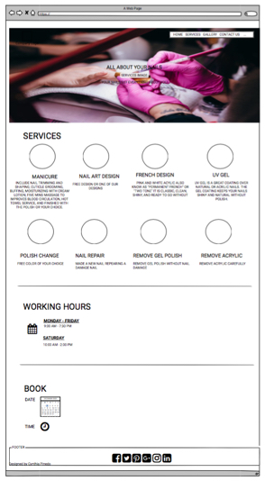
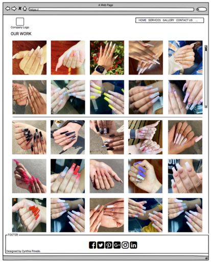
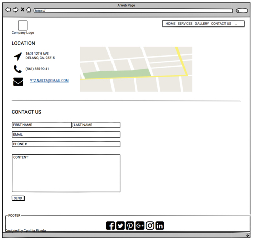

## Testing
1. **Header**. NAV Menu allows to access to each individual page successfully.
2. **Footer**. Social Media allows to new pages with successful link.
3. The **W3C Markup Validation Service** for each HTML page: 
- index.html
- services.html
- gallery.html
- contact.html
- reviews.html

4. The **W3C CSS Validation Service** for style.css

5. **Responsive Design** for all pages.

6. Spell and orthographic


<h1 align="center">Ytz.Nailz Project Website</h1>

## Project for Milestone 1- User Centric Web Design.
## Name
Ytz. Nailz is a site for promote nails’ services and styles.
## Deployed Page
[https://cynthiapinedoh79.github.io/ytz.nailz/](https://cynthiapinedoh79.github.io/ytz.nailz/)

This is the main marketing website for Ytz.Nailz. It is designed to be responsibe and accessible on a range of devices, making it easy to navigate for customers.

<h2 align="center">
    
    
    </h2>

## Description
The site contains a small portion of content that has a clear and illustrated informational purpose.
The purposes of this site are
1.	Create Online Presence
2.	Promote our services
3.	Attract new customers
4.	Customers interaction (appointments, comments & reviews)
5.	Increase rating.
6.	In a future plan add e-commerce.

## Tradeoffs
 

## Wireframe
"https://balsamiq.cloud/s45whoh/p56wz1i/r2278"
 






## User Experience (UX)

-   ### User stories

    -   #### First Time Visitor Goals

        - As a First Time Visitor:
            1. I want to easily understand the main purpose of the site and learn more about the organization or company.
            2. I want to be able to easily navigate throughout the site to find content of my interest.
            3. I want to look for testimonials to understand if they are trusted. 
            4. I also want to locate their social media links to see their posts, their followings and determine how trusted and known they are.

    -   #### Returning Visitor Goals

        - As a Returning Visitor, 
            1. I want to find more information about the services that they provide and working hours.
            2. I want to find the best way to get in contact with the organisation with any questions I may have.
            3. I want to find community links.
            4. I want to be able to leave a customer review.

    -   #### Frequent User Goals
        - As a Frequent User,
            1. I want to check to see if there are any newly added promotions.
            2. I want to check to see if there are any new blog posts.
            3. I want to sign up to the Newsletter so that I am emailed any major updates and/or changes to the website or organisation.
            4. I want to schedule an apointment.

-   ### Design
    -   #### Colour Scheme
        -   The two main colours are black and yellow to contrast.
    -   #### Typography
        -   Roboto family font is the main font used throughout the whole website with Sans Serif as the fallback font in case for any reason the font isn't being imported into the site correctly. Roboto is a clean font used frequently in programming, so it is both attractive and appropriate.
    -   #### Imagery
        -   Imagery is important. The large, background hero image is designed to be striking and catch the user's attention. It has style, fashion and class.
    -   #### Description        
            This website is for actual customers or new customers, users can navigate through the following pages:
            

            
*   ### Wireframes

    -   Home Page Wireframe - [View](https://cynthiapinedoh79.github.io/ytz.nailz/)
    	    This is the main page, all pages contains same Header and Footer.
                a.	Header. It has a Nav bar to navigate easily through the diferents pages.
                b.	Footer. It has the Social Media links.
    -   Services Page Wireframe - [View](https://cynthiapinedoh79.github.io/ytz.nailz/services.html)           
            This page shows the services that Ytz.Nailz provides:
                a.	Manicure
                b.	Nail Art Design
                c.	French Design
                d.	UV Gel
                e.	Polish Change
                f.	Remove Gel Polish
                g.	Nail Repair
                h.	Remove Acrylic
            And Hours of Operation with our working hours.
        
        -   Gallery Page Wireframe - [View](https://cynthiapinedoh79.github.io/ytz.nailz/gallery.html)           
            Shows our work with a pictures gallery with a brief description of each one.

        -   Contact Us Page Wireframe - [View](https://cynthiapinedoh79.github.io/ytz.nailz/contact.html)           
            This page contains the information of our place: location address, phone number, email, map, and a simple form for contact us.

        -   Rate Us Page Wireframe - [View](https://cynthiapinedoh79.github.io/ytz.nailz/reviews.html)           
            This page has the purpose to promote our services with the customer’s reviews and mainly improve them.


## Features

-   Navbar with responsive design (Hamburguer Icon).

-   Responsive on all device sizes

-   Interactive elements

-   Simple animations on cover Images for pages.


## Technologies Used

### Languages Used

-   [HTML5](https://en.wikipedia.org/wiki/HTML5) Hypertext Markup Language.
-   [CSS3](https://en.wikipedia.org/wiki/Cascading_Style_Sheets) Cascading Style Sheets.

### Frameworks, Libraries & Programs Used

1. [Bootstrap 4.4.1:](https://getbootstrap.com/docs/4.4/getting-started/introduction/)
    - Bootstrap was used to assist with the responsiveness and styling of the website. This framework helps designing websites. It includes HTML and CSS based design templates for typography, forms, buttons, tables, navigation, modals, image carousels, etc. It also gives you support for JavaScript plugins. 
2. [Hover.css:](https://ianlunn.github.io/Hover/)
    - Hover.css was used on the Social Media icons in the footer to add the float transition while being hovered over.
3. [Google Fonts:](https://fonts.google.com/)
    - Google fonts were used to import the 'Titillium Web' font into the style.css file which is used on all pages throughout the project.
4. [Font Awesome:](https://fontawesome.com/)
    - Font Awesome was used on all pages throughout the website to add icons for aesthetic and UX purposes. Designers love the use of icons as fonts because of the flexibility of styling available with high-quality iconography on every device.
5. [jQuery:](https://jquery.com/)
    - jQuery came with Bootstrap to make the navbar responsive but was also used for the smooth scroll function in JavaScript. JQuery for DOM manipulation.
6. [Git](https://git-scm.com/)
    - Git was used for version control by utilizing the Gitpod terminal to commit to Git and Push to GitHub.
7. [GitHub:](https://github.com/)
    - GitHub is used to store the projects code after being pushed from Git.
8. [Photoshop:](https://www.adobe.com/ie/products/photoshop.html)
    - Photoshop was used to create the logo, resizing images and editing photos for the website.
9. [Balsamiq:](https://balsamiq.com/)
    - Balsamiq was used to create the [wireframes]("https://balsamiq.cloud/s45whoh/p56wz1i/r2278") during the design process.

## Testing

The W3C Markup Validator and W3C CSS Validator Services were used to validate every page of the project to ensure there were no syntax errors in the project.

-   [W3C Markup Validator](https://jigsaw.w3.org/css-validator/#validate_by_input) - [Results](https://github.com/)
-   [W3C CSS Validator](https://jigsaw.w3.org/css-validator/#validate_by_input) - [Results](https://github.com/)

### Testing User Stories from User Experience (UX) Section

-   #### First Time Visitor Goals

    1. As a First Time Visitor, I want to easily understand the main purpose of the site and learn more about the organization or company.

        1. Upon entering the site, users access to a clean and easily readable navigation bar to go to the page of their choice.
        2. The main pages are made immediately with the hero image.
        3. The user has two options, click the call to action buttons or scroll down, both of which will lead to the same place, to learn more about the organisation.

    2. As a First Time Visitor, I want to be able to easily navigate throughout the site to find content of my interest.

        1. The site has been designed to be fluid and never to entrap the user. At the top of each page there is a clean navigation bar.
        2. On the Contact Us Page, after a form response is submitted, the page refreshes and the user is brought to the top of the page where the navigation bar is.

    3. As a First Time Visitor, I want to look for testimonials to understand if they are trusted. 
        1. Once the new visitor has read the About Us and What We Do text, they will notice the Why We are Loved So Much section.
        2. The user can also scroll to the bottom of any page on the site to locate social media links in the footer.
        3. At the bottom of the Contact Us page, the user is told underneath the form, that alternatively they can contact the organisation on social media which highlights the links to them.

-   #### Returning Visitor Goals

    1. As a Returning Visitor, I want to find more information about the services that they provide and working hours.

        1. These are clearly shown in the banner message.
        2. They will be directed to a page with another hero image and call to action.

    2. As a Returning Visitor, I want to find the best way to get in contact with the organisation with any questions I may have.

        1. The navigation bar clearly highlights the "Contact Us" Page.
        2. Here they can fill out the form on the page or are told that alternatively they can message the organisation on social media.
        3. The footer contains links to the organisations Facebook, Twitter and Instagram page as well as the organization's email.
        4. Whichever link they click, it will be open up in a new tab to ensure the user can easily get back to the website.
        5. The email button is set up to automatically open up your email app and autofill there email address in the "To" section.

    3. As a Returning Visitor, I want to find community links.
        1. The Facebook Page can be found at the footer of every page and will open a new tab for the user and more information can be found on the Facebook page.
        2. Alternatively, the user can scroll to the bottom of the Home page to find the Facebook Group redirect card and can easily join by clicking the "Join Now!" button which like any external link, will open in a new tab to ensure they can get back to the website easily.
        3. If the user is on the "Our Favourites" page they will also be greeted with a call to action button to invite the user to the Facebook group. The user is incentivized as they are told there is a weekly favourite product posted in the group.

    4. As a Returning Visitor, I want to be able to leave a customer review.
        1. jjhdd
        2. fmdkjfk
        3. If 


-   #### Frequent User Goals

    1. As a Frequent User, I want to check to see if there are any newly added promotions.

        1. The user would already be comfortable with the website layout and can easily click the banner message.

    2. As a Frequent User, I want to check to see if there are any new blog posts.

        1. The user would already be comfortable with the website layout and can easily click the blog link

    3. As a Frequent User, I want to sign up to the Newsletter so that I am emailed any major updates and/or changes to the website or organisation.
        1. At the bottom of every page their is a footer which content is consistent throughout all pages.
        2. To the right hand side of the footer the user can see "Subscribe to our Newsletter" and are prompted to Enter their email address.
        3. There is a "Submit" button to the right hand side of the input field which is located close to the field and can easily be distinguished.

    4. As a Frecuent User, I want to schedule an apointment.
        1. jjhdd
        2. fmdkjfk
        3. If 

### Further Testing

-   The Website was tested on Google Chrome, Internet Explorer, Microsoft Edge and Safari browsers.
-   The website was viewed on a variety of devices such as Desktop, Laptop, iPhone7, iPhone 8 & iPhoneX.
-   A large amount of testing was done to ensure that all pages were linking correctly.
-   Friends and family members were asked to review the site and documentation to point out any bugs and/or user experience issues.

### Known Bugs

-   On some mobile devices the Hero Image pushes the size of screen out more than any of the other content on the page.
    -   A white gap can be seen to the right of the footer and navigation bar as a result.
-   On Microsoft Edge and Internet Explorer Browsers, all links in Navbar are pushed upwards when hovering over them.

## Deployment

### GitHub Pages

The project was deployed to GitHub Pages using the following steps...

1. Log in to GitHub and locate the [GitHub Repository](https://github.com/)
2. At the top of the Repository (not top of page), locate the "Settings" Button on the menu.
    - Alternatively Click [Here](https://raw.githubusercontent.com/) for a GIF demonstrating the process starting from Step 2.
3. Scroll down the Settings page until you locate the "GitHub Pages" Section.
4. Under "Source", click the dropdown called "None" and select "Master Branch".
5. The page will automatically refresh.
6. Scroll back down through the page to locate the now published site [link](https://github.com) in the "GitHub Pages" section.

### Forking the GitHub Repository

By forking the GitHub Repository we make a copy of the original repository on our GitHub account to view and/or make changes without affecting the original repository by using the following steps...

1. Log in to GitHub and locate the [GitHub Repository](https://github.com/)
2. At the top of the Repository (not top of page) just above the "Settings" Button on the menu, locate the "Fork" Button.
3. You should now have a copy of the original repository in your GitHub account.

### Making a Local Clone

1. Log in to GitHub and locate the [GitHub Repository](https://github.com/)
2. Under the repository name, click "Clone or download".
3. To clone the repository using HTTPS, under "Clone with HTTPS", copy the link.
4. Open Git Bash
5. Change the current working directory to the location where you want the cloned directory to be made.
6. Type `git clone`, and then paste the URL you copied in Step 3.

```
$ git clone https://github.com/YOUR-USERNAME/YOUR-REPOSITORY
```

7. Press Enter. Your local clone will be created.

```
$ git clone https://github.com/YOUR-USERNAME/YOUR-REPOSITORY
> Cloning into `CI-Clone`...
> remote: Counting objects: 10, done.
> remote: Compressing objects: 100% (8/8), done.
> remove: Total 10 (delta 1), reused 10 (delta 1)
> Unpacking objects: 100% (10/10), done.
```

Click [Here](https://help.github.com/en/github/creating-cloning-and-archiving-repositories/cloning-a-repository#cloning-a-repository-to-github-desktop) to retrieve pictures for some of the buttons and more detailed explanations of the above process.

## Credits

### Code

-   [StackOverflow post](https://stackoverflow.com)

-   [Bootstrap4](https://getbootstrap.com/docs/4.4/getting-started/introduction/): Bootstrap Library used throughout the project mainly to make site responsive using the Bootstrap Grid System.

### Content

-   All content was written by the developer.

-   Psychological properties of colours text in the README.md was found [here](http://www.colour-affects.co.uk/psychological-properties-of-colours)

### Media

Images are from:
-  Ytz.Nails works, 

and external websites:

- [freestocks](https://freestocks.org/)
- [pixabay](https://pixabay.com/)
- [unsplash](https://unsplash.com/)
- [pexels](https://pexels.com/)

### Acknowledgements

-   My Mentor for continuous helpful feedback.
-   Tutor support at Code Institute for their support.
-   Code Institute for the invaluable course.
-   I received inspiration for this project from my learning on Code Institute.